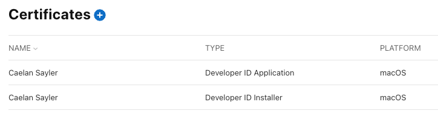

| [docs](.) / signing.md |
|:---|

# Code Signing
Code signing is an essential part of application distribution. On Windows, applications without code signatures are likely to be flagged as viruses. On OSX, codesigning and Notarization is required before your application can be run by users.

## Signing on Windows
tbc

## Signing & Notarizing on OSX
Codesigning and Notarization is required before your application can be run by users, therefore it is a required step before deploying your application.

### Creating code signing certificates
1. First, you will need to create an account at https://developer.apple.com, pay the annual developer fee, and accept any license agreements. 
0. Navigate to your certificates: https://developer.apple.com/account/resources/certificates
0. Click the (+) icon to create new certificates. You need to create both a `Developer ID Installer` and a `Developer ID Application` certificate for distribution of Velopack apps outside the Mac App Store. 
0. Open both certificates by clicking on them, press Download, and then double click the ".cer" file to install it to your local keychain.

### Setting up a NotaryTool profile
1. Create an app-specific password: https://support.apple.com/en-us/102654. You will only be shown this password once, so save or write it down somewhere.
0. Find your apple team ID: https://developer.apple.com/account#MembershipDetailsCard
0. Store your Apple account credentials to a new NotaryTool profile:
   ```sh
   xcrun notarytool store-credentials \
       --apple-id "yourapple@account.com" \
       --team-id "your-located-team-id" \
       --password "your-generated-app-specific-password" \
       "your-local-profile-name-here"
   ```

### Putting it all together
Now that you have your NotaryTool profile and code signing certificates installed, you can add the following parameters to your `pack` command:

```sh
vpk pack \
    ... 
    --signAppIdentity "Developer ID Application: Your Name" \
    --signInstallIdentity "Developer ID Installer: Your Name" \
    --notaryProfile "your-local-profile-name-here" \
```

When these parameters are specified and valid, Velopack will automatically code sign and notarize your application and installer packages.

### Automate signing in CI/CD (Github Actions)
It is also posible to store your certificates and notary credentials as Action Secrets and sign your code during CI builds.

1. Launch Keychain Access and open the "My Certificates" pane.
0. Select both certificates, right click and select "Export". Save as a p12 file and make note of the password. You can use the same password for both certificates.
0. Copy the contents of the certificate to clipboard as base64, example:
   ```sh
   base64 -i CERT.p12 | pbcopy
   ```
0. Create 7 [Github Secrets](https://docs.github.com/en/actions/security-guides/using-secrets-in-github-actions) for your Actions workflows
   - `BUILD_CERTIFICATE_BASE64` (b64 of your app cert)
   - `INSTALLER_CERTIFICATE_BASE64` (b64 of your installer cert)
   - `P12_PASSWORD` (password for the certificates)
   - `APPLE_ID` (your apple username)
   - `APPLE_PASSWORD` (your app-specific password from earlier)
   - `APPLE_TEAM` (your team id from earlier)
   - `KEYCHAIN_PASSWORD` (can be any random string, will be used to create a new keychain)

0. Add a step to your workflow which installs the certificates and keychain profile. Here is an example:
   ```yml
   name: App build & sign
   on: push
   jobs:
     build_with_signing:
       runs-on: macos-latest
       steps:
         - name: Checkout repository
           uses: actions/checkout@v4

         - name: Install Apple certificates and notary profile
           env:
             BUILD_CERTIFICATE_BASE64: ${{ secrets.BUILD_CERTIFICATE_BASE64 }}
             INSTALLER_CERTIFICATE_BASE64: ${{ secrets.INSTALLER_CERTIFICATE_BASE64 }}
             P12_PASSWORD: ${{ secrets.P12_PASSWORD }}
             APPLE_ID: ${{ secrets.APPLE_ID }}
             APPLE_PASSWORD: ${{ secrets.APPLE_PASSWORD }}
             APPLE_TEAM: ${{ secrets.APPLE_TEAM }}
             KEYCHAIN_PASSWORD: ${{ secrets.KEYCHAIN_PASSWORD }}
           run: |
             # create variables for file paths
             CERT_BUILD_PATH=$RUNNER_TEMP/build_certificate.p12
             CERT_INSTALLER_PATH=$RUNNER_TEMP/installer_certificate.p12
             KEYCHAIN_PATH=$RUNNER_TEMP/app-signing.keychain-db
   
             # import certificates from secrets
             echo -n "$BUILD_CERTIFICATE_BASE64" | base64 --decode -o $CERT_BUILD_PATH
             echo -n "$INSTALLER_CERTIFICATE_BASE64" | base64 --decode -o $CERT_INSTALLER_PATH
   
             # create temporary keychain
             security create-keychain -p "$KEYCHAIN_PASSWORD" $KEYCHAIN_PATH
             security set-keychain-settings -lut 21600 $KEYCHAIN_PATH
             security unlock-keychain -p "$KEYCHAIN_PASSWORD" $KEYCHAIN_PATH
   
             # import certificates to keychain
             security import $CERT_BUILD_PATH -P "$P12_PASSWORD" -A -t cert -f pkcs12 -k $KEYCHAIN_PATH
             security import $CERT_INSTALLER_PATH -P "$P12_PASSWORD" -A -t cert -f pkcs12 -k $KEYCHAIN_PATH
             security list-keychain -d user -s $KEYCHAIN_PATH
   
             # create notarytool profile
             xcrun notarytool store-credentials --apple-id "$APPLE_ID" --team-id "$APPLE_TEAM" --password "$APPLE_PASSWORD" velopack-profile

         - name: Build app
           ...

         - name: Create Velopack Release
           run: |
             dotnet tool install -g vpk
             vpk ... --signAppIdentity "Developer ID Application: Your Name" --signInstallIdentity "Developer ID Installer: Your Name" --notaryProfile "velopack-profile"

         - name: Clean up keychain
           if: ${{ always() }}
           run: security delete-keychain $RUNNER_TEMP/app-signing.keychain-db
   ```